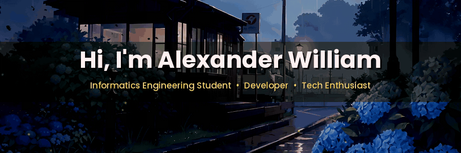

  

  
  

---

## 🧑‍💻 About Me

🎓 Informatics Engineering student who enjoys **building real applications**, experimenting with new technologies, and understanding how things work behind the code.

- 🌐 Web Development
- 📱 Android Development
- 🐍 Python & Data Engineering
- 🚀 Turning ideas into real projects

> `Learn → Build → Break → Fix → Improve → Repeat`

---

## ⚡ Tech Stack

| Category | Technologies |
| :-- | :-- |
| 💻 **Languages** |  |
| 🌐 **Web** |  |
| 📱 **Mobile** |  |
| 🗄️ **Database** |  |
| 🛠️ **Tools** |  |

---

## 🚀 Featured Projects

<table>
<tr>
<td width="50%" valign="top">

### 🎓 SAKTI Portal
**Sistem Admisi Kanisius Terintegrasi**
A web-based admission and parent portal system.

`Laravel` `PHP` `MySQL` `Blade`

</td>
<td width="50%" valign="top">

### 🎲 Dice Roller
A simple Android application for rolling dice.

`Kotlin` `Android Studio`

</td>
</tr>
<tr>
<td width="50%" valign="top">

### 📖 Comic Hub
A modern web project for exploring and managing comics.

`Next.js` `React` `Tailwind CSS`

</td>
<td width="50%" valign="top">

### 📚 TypeScript Learning
A repository for learning TypeScript, JavaScript and testing.

`TypeScript` `Jest` `Babel`

</td>
</tr>
</table>

---

## 📈 Currently Learning

Full-Stack Web · Android (Kotlin/Java) · Python & Data Engineering · TypeScript · Laravel · Databases · Algorithms

## 💡 Interests

🤖 Artificial Intelligence · 🔐 Cybersecurity & Cryptography · ☁️ Backend Development · 🧩 Algorithms & Optimization

---

## 📊 GitHub Stats

---

### 💻 Code. Learn. Build. Repeat.

⭐ If you find something interesting here, feel free to explore my repositories!

